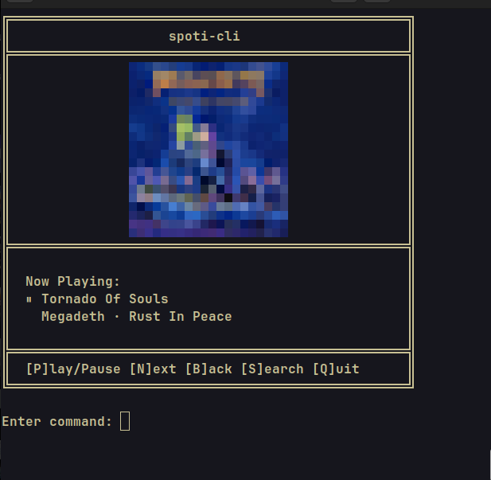
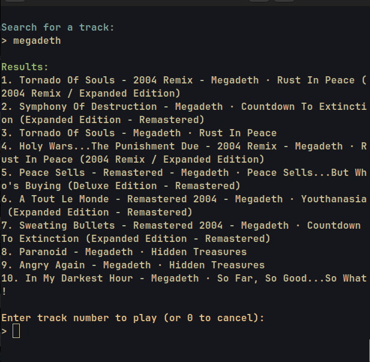

# spoti-cli

A command-line Spotify player with album art visualization.

## Description

Control your Spotify playback from the terminal. Features include playback controls, track search, and album art display using ANSI pixel art.

## Preview

### Main Interface



### Search



## Requirements

- Python 3.8 or higher
- Spotify Premium account
- Linux (for auto-start feature)

## Installation

1. Clone the repository:

```bash
git clone https://github.com/yourusername/spoti-cli.git
cd spoti-cli
```

2. Install uv (if not already installed):

```bash
curl -LsSf https://astral.sh/uv/install.sh | sh
```

3. Install dependencies:

```bash
uv sync
```

## Setup

1. Create a Spotify application:

   - Go to https://developer.spotify.com/dashboard
   - Click "Create app"
   - Set Redirect URI to `http://127.0.0.1:8888/callback`
   - Save your Client ID and Client Secret

2. Create a `.env` file in the project root:

```
SPOTIFY_CLIENT_ID=your_client_id_here
SPOTIFY_CLIENT_SECRET=your_client_secret_here
SPOTIFY_REDIRECT_URI=http://127.0.0.1:8888/callback
SPOTIFY_AUTH_PORT=8888
```

3. Run the application:

```bash
uv run python main.py
```

4. On first run, your browser will open for Spotify authentication. Authorize the app.

## Usage

The application displays a terminal interface with the following commands:

- `p` - Play/Pause
- `n` - Next track
- `b` - Previous track
- `s` - Search for tracks
- `q` - Quit

## Features

- Playback control (play, pause, skip)
- Track search and selection
- Album art display as ANSI pixel art
- Automatic track change detection
- Auto-start Spotify if not running (Linux only)

## Notes

- Spotify Premium is required for playback control
- Spotify must be open on at least one device
- The application checks for track changes every 2 seconds
- Album art is downloaded and converted to terminal graphics

## Troubleshooting

**"No active device found"**

- Open Spotify on any device (desktop, mobile, or web player)
- Start playing any track, then you can control it from the CLI

**"Forbidden: requires Premium"**

- Playback control requires a Spotify Premium subscription

**Authentication issues**

- Delete `tokens.json` and re-authenticate
- Verify your Client ID and Secret in `.env`
